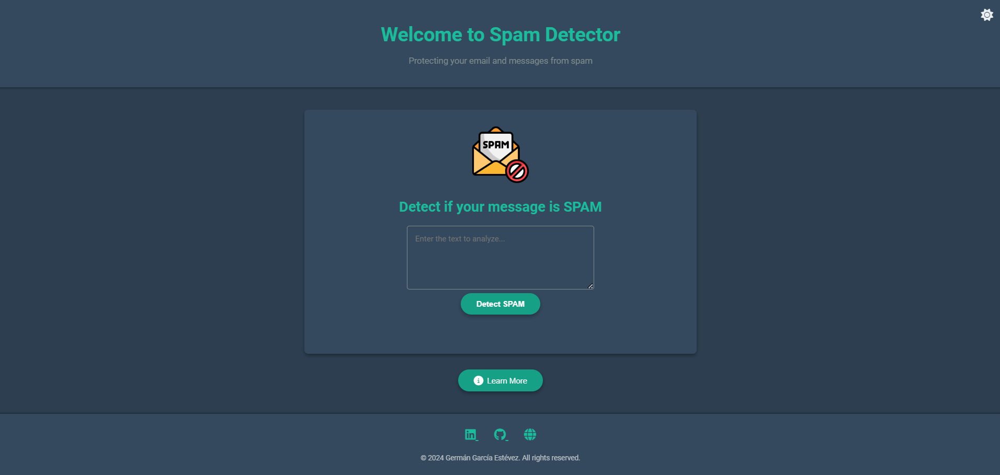

# 📧 Aplicación de Detección de Spam

## 📑 Índice de Contenidos
- [Características](#-características)
- [Capturas de Pantalla](#-capturas-de-pantalla)
- [Tecnologías Utilizadas](#️-tecnologías-utilizadas)
- [Requisitos Previos](#-requisitos-previos)
- [Instalación](#-instalación)
- [Uso](#-uso)
- [Estructura del Proyecto](#-estructura-del-proyecto)
- [Contribuir](#-contribuir)
- [Licencia](#-licencia)
- [Agradecimientos](#-agradecimientos)

Esta aplicación web permite detectar si un mensaje de texto es spam o no spam utilizando técnicas de Machine Learning. El modelo ha sido entrenado con un dataset de mensajes clasificados y utiliza procesamiento de lenguaje natural para realizar las predicciones.

## 🚀 Características

- Interfaz web intuitiva y fácil de usar
- Análisis en tiempo real de mensajes
- Visualización de la probabilidad de spam
- Modelo de Machine Learning pre-entrenado
- API REST para integración con otros sistemas

## 📸 Capturas de Pantalla

### Página Principal

*Interfaz principal de la aplicación donde los usuarios pueden ingresar mensajes para análisis*

### Resultados del Análisis

*Visualización de los resultados del análisis de spam*

## 🛠️ Tecnologías Utilizadas

- Python 3.8+
- Flask (Framework web)
- Scikit-learn (Machine Learning)
- NLTK (Procesamiento de Lenguaje Natural)
- Bootstrap (Frontend)
- HTML/CSS/JavaScript

## 📋 Requisitos Previos

```bash
Python 3.8 o superior
pip (gestor de paquetes de Python)
Git
```

## 🔧 Instalación

1. Clona el repositorio:
```bash
git clone https://github.com/germangarest/clasificador_spam.git
cd app_spam
```

2. Crea y activa un entorno virtual:
```bash
python -m venv venv
# En Windows
venv\Scripts\activate
# En Linux/Mac
source venv/bin/activate
```

3. Instala las dependencias:
```bash
pip install -r requirements.txt
```

## 💻 Uso

1. Inicia la aplicación:
```bash
python app.py
```

2. Abre tu navegador y ve a:
```
http://localhost:5000
```

3. Ingresa el texto que deseas analizar y haz clic en "Analizar".

## 📊 Estructura del Proyecto

```
app_spam/
│
├── app.py                 # Aplicación principal Flask
├── entrenamiento_modelo.py# Script de entrenamiento del modelo
├── requirements.txt       # Dependencias del proyecto
│
├── data/                 # Datos de entrenamiento y prueba
│   └── ...
│
├── models/              # Modelos entrenados
│   └── ...
│
├── static/             # Archivos estáticos (CSS, JS)
│   └── ...
│
├── templates/          # Plantillas HTML
│   └── ...
│
└── utils/             # Utilidades y funciones auxiliares
    └── ...
```

## 🤝 Contribuir

Las contribuciones son bienvenidas. Para contribuir:

1. Haz un Fork del proyecto
2. Crea una nueva rama (`git checkout -b feature/AmazingFeature`)
3. Realiza tus cambios
4. Commit tus cambios (`git commit -m 'Add some AmazingFeature'`)
5. Push a la rama (`git push origin feature/AmazingFeature`)
6. Abre un Pull Request

## 📝 Licencia

Este proyecto está bajo la Licencia MIT - ver el archivo [LICENSE.md](LICENSE.md) para más detalles.

## 🙏 Agradecimientos

- Mencionar cualquier recurso, tutorial o persona que haya ayudado en el desarrollo
- Dataset utilizado para el entrenamiento
- Comunidad de desarrolladores

---
⌨️ con ❤️ por [Germán García Estévez](https://www.linkedin.com/in/germangarest) 😊
